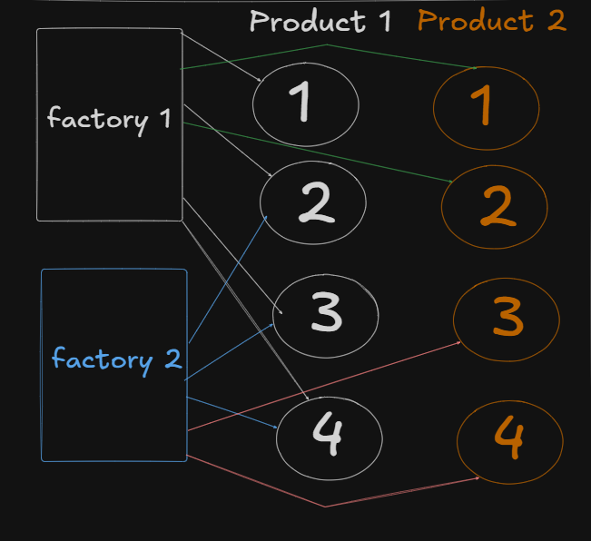

# Abstract Factory Pattern

## 1. Definition

The Abstract Factory Pattern provides an interface for creating families of related or dependent objects without specifying their concrete classes.

It encapsulates the creation logic of a subset of related products inside concrete factory subclasses, while abstracting this logic from the client.

---

## 2. Intent

- Create families of related objects.
- Ensure product compatibility within a family.
- Decouple client code from concrete implementations.
- Improve adherence to the Open/Closed Principle.
- Centralize creation logic for related product groups.

---

## 3. Problem It Solves

When a system must create multiple related objects that are designed to work together, directly instantiating them causes:

- Tight coupling between client and concrete classes.
- Risk of mixing incompatible products.
- Scattered creation logic.
- Violation of Open/Closed Principle.

Abstract Factory ensures:

- Product families remain consistent.
- Client does not depend on concrete implementations.
- Entire ecosystems can change by switching factory.

---

## 4. Conceptual Mapping

<p align="center">
  
</p>

Explanation of the diagram:

- There are multiple product hierarchies (Product 1 and Product 2).
- Each concrete factory creates a subset of related products.
- Factory 1 creates Product1(1,2,3) and Product2(1,2).
- Factory 2 creates Product1(3,4) and Product2(3,4).
- Each factory defines a compatible product family.
- The client selects the factory, not individual products.

Switching the factory switches the entire product family.

---

## 5. Structure

### 5.1 Abstract Products

```java
interface Burger {
    void prepare();
}

interface GarlicBread {
    void prepare();
}
```

---

### 5.2 Concrete Products (Family 1)

```java
class BasicBurger implements Burger {
    public void prepare() {
        System.out.println("Preparing Basic Burger");
    }
}

class BasicGarlicBread implements GarlicBread {
    public void prepare() {
        System.out.println("Preparing Basic Garlic Bread");
    }
}
```

---

### 5.3 Concrete Products (Family 2)

```java
class BasicWheatBurger implements Burger {
    public void prepare() {
        System.out.println("Preparing Basic Wheat Burger");
    }
}

class BasicWheatGarlicBread implements GarlicBread {
    public void prepare() {
        System.out.println("Preparing Basic Wheat Garlic Bread");
    }
}
```

---

### 5.4 Abstract Factory

```java
interface MealFactory {
    Burger createBurger();
    GarlicBread createGarlicBread();
}
```

---

### 5.5 Concrete Factories

```java
class SinghBurger implements MealFactory {

    public Burger createBurger() {
        return new BasicBurger();
    }

    public GarlicBread createGarlicBread() {
        return new BasicGarlicBread();
    }
}
```

```java
class KingBurger implements MealFactory {

    public Burger createBurger() {
        return new BasicWheatBurger();
    }

    public GarlicBread createGarlicBread() {
        return new BasicWheatGarlicBread();
    }
}
```

---

## 6. Client Code

```java
public class Main {

    public static void main(String[] args) {

        MealFactory factory = new SinghBurger();

        Burger burger = factory.createBurger();
        GarlicBread garlicBread = factory.createGarlicBread();

        burger.prepare();
        garlicBread.prepare();
    }
}
```

The client interacts only with:

- Abstract factory
- Abstract product interfaces

It does not depend on concrete implementations.

---

## 7. Key Characteristics

- Creates multiple related product hierarchies.
- Ensures product compatibility within a family.
- Removes conditional logic from client.
- Supports switching entire product ecosystems at runtime.
- Promotes loose coupling and extensibility.

---

## 8. Factory Method vs Abstract Factory

| Factory Method | Abstract Factory |
|----------------|------------------|
| Creates one product type | Creates multiple related product types |
| Uses inheritance to vary product | Uses composition of multiple factory methods |
| Subclass decides product | Concrete factory decides entire family |
| Focus: single product creation | Focus: product families |

---

## 9. When to Use

Use Abstract Factory when:

- A system must create families of related objects.
- Products within a family must be compatible.
- You want to isolate product creation logic.
- You want to switch product ecosystems easily.
- Multiple concrete factories manage different subsets of related products.

---

## 10. Conclusion

The Abstract Factory Pattern encapsulates the creation of related product families while abstracting the client from concrete implementations.

It ensures:

- Product consistency
- Reduced coupling
- Improved maintainability
- Strong adherence to the Open/Closed Principle

By selecting a concrete factory, the client transparently switches the entire product family without changing its own logic.
