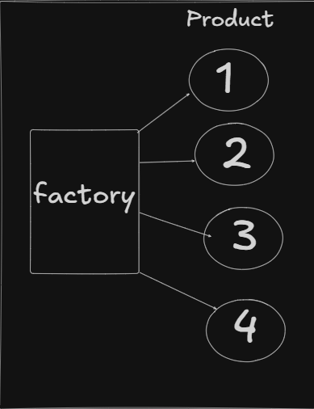

# Factory Design Pattern

## Overview

The **Factory Design Pattern** is used to prevent the client from directly instantiating objects.  
Instead of using the `new` keyword in client code, object creation is delegated to a dedicated Factory class.

This centralizes object creation logic and reduces coupling between the client and concrete implementations.

---

## Intent

> Encapsulate object creation logic and allow clients to depend on abstractions rather than concrete classes.

---

## Problem

- Without Factory Pattern:

```java
Car car = new SUV();
```
The client becomes tightly coupled to the concrete class (SUV).

If the implementation changes or a new type is introduced, client code must also change.
This increases maintenance cost and violates separation of concerns.

Solution
- Use a Factory class to handle object creation:
```
Car car = CarFactory.createCar("SUV");
```
Now:

- The client depends only on the Car interface.

- The factory decides which concrete class to instantiate.

Object creation logic is centralized.

## Conceptual Mapping

<p align="center">
  
</p>

Explanation of the diagram:

- There is a single product hierarchy Product.
- There is a factory which creates all the products.
- Factory is already selected , the client selects which product to instantiate by passing arguments.


Example Implementation
- 1️ Product Interface
```
interface Car {
    void drive();
}
```
- 2️ Concrete Products
```
class SUV implements Car {
    public void drive() {
        System.out.println("Driving SUV");
    }
}
```
```
class Sedan implements Car {
    public void drive() {
        System.out.println("Driving Sedan");
    }
}
```
- 3️ Factory Class
```
class CarFactory {

    public static Car createCar(String type) {

        if (type.equalsIgnoreCase("SUV"))
            return new SUV();

        if (type.equalsIgnoreCase("Sedan"))
            return new Sedan();

        throw new IllegalArgumentException("Unknown car type");
    }
}
```
- 4️ Client Code
```
public class Main {

    public static void main(String[] args) {

        Car car = CarFactory.createCar("SUV");
        car.drive();
    }
}
```
### Benefits
- Centralized object creation

- Reduced coupling between client and concrete classes

- Improved maintainability

- Cleaner client code

- Follows Single Responsibility Principle (SRP)

- Makes the system easier to extend

## Summary
The Factory Pattern improves system design by centralizing object creation, reducing tight coupling, and promoting cleaner separation of responsibilities.

It makes the codebase more maintainable and easier to extend as new implementations are introduced.

