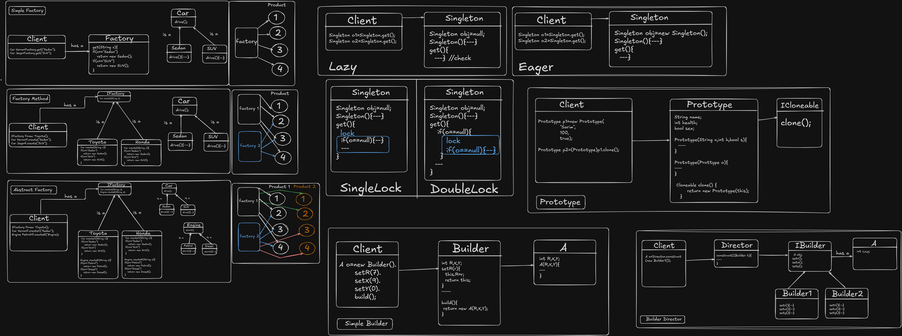

# Creational Design Patterns



Creational Design Patterns focus on **object creation mechanisms**.  
They abstract the instantiation process and help make systems:

- More flexible  
- Less coupled  
- Easier to extend  
- More maintainable  

These patterns solve problems related to **how objects are created**.

---

# 1. Factory Pattern

## Intent

Provide an interface for creating objects while allowing subclasses or logic to decide which class to instantiate.

Creation logic is centralized and hidden from the client.

---

## What Problem It Solves

- Removes direct object creation (`new`) from client code  
- Reduces tight coupling between client and concrete classes  
- Allows runtime decision of object type  
- Promotes Open/Closed Principle  

Instead of:

```java
Car c = new BMW();
```

You do:

```java
Car c = CarFactory.create("BMW");
```

---

## What It Solves Conceptually

- Creation logic delegation  
- Class selection complexity  
- Conditional object creation logic  
- Scalability issues when adding new types  

---

## Limitations

- Can introduce too many factory classes  
- Adds extra abstraction layer  
- Harder to understand for small/simple systems  
- Violates Open/Closed Principle if not designed properly (when using if-else chains)

---

# 2. Singleton Pattern

## Intent

Ensure a class has **only one instance** and provide a global access point to it.

---

## What Problem It Solves

- Controlled access to shared resource  
- Prevents multiple object creation  
- Ensures consistency across system  

Common Use Cases:

- Logger  
- Configuration manager  
- Database connection pool  
- Thread pool  

---

## What It Solves Conceptually

- Global state management  
- Resource duplication issues  
- Centralized coordination  

---

## Limitations

- Acts like a global variable (can increase coupling)  
- Harder to test (difficult to mock)  
- Breaks Single Responsibility Principle sometimes  
- Can cause hidden dependencies  
- Multithreading complexity  

---

# 3. Builder Pattern

## Intent

Separate the construction of a complex object from its representation so that the same construction process can create different representations.

---

## What Problem It Solves

- Telescoping constructor anti-pattern  
- Complex object initialization  
- Optional parameter overload  
- Poor readability of constructors  

Instead of:

```java
new User("John", 25, null, null, "NY");
```

You do:

```java
User user = new User.Builder("John")
                  .age(25)
                  .address("NY")
                  .build();
```

---

## What It Solves Conceptually

- Step-by-step object creation  
- Improves readability  
- Supports immutability  
- Separates construction from representation  

---

## Limitations

- Extra code (builder class)  
- Overkill for small/simple objects  
- Increases number of classes  
- Not ideal when object has very few fields  

---

# 4. Prototype Pattern

## Intent

Create new objects by **cloning an existing object**, rather than creating them from scratch.

---

## What Problem It Solves

- Expensive object initialization  
- Heavy setup logic  
- Complex configuration duplication  
- Runtime object duplication  

Instead of repeatedly doing heavy setup:

```java
NPC npc = new NPC(...heavy setup...);
```

You:

1. Create one template  
2. Clone it  
3. Modify only necessary properties  

---

## What It Solves Conceptually

- Reduces object creation cost  
- Improves performance  
- Avoids subclass explosion  
- Enables dynamic object duplication  

---

## Limitations

- Deep vs shallow copy complexity  
- Cloning complex object graphs is difficult  
- Can break encapsulation  
- Requires careful handling of references  
- Debugging clone issues can be tricky  

---

# Summary Comparison

| Pattern     | Intent | Main Problem Solved | Major Limitation |
|------------|--------|--------------------|------------------|
| Factory    | Centralize object creation | Removes direct instantiation & tight coupling | Can grow complex with many types |
| Singleton  | Single instance globally | Prevents multiple instances of shared resource | Global state issues, testing difficulty |
| Builder    | Step-by-step object creation | Telescoping constructors, readability | Extra classes, overkill for simple objects |
| Prototype  | Clone existing objects | Expensive initialization, duplication | Deep copy complexity |

---

# Big Picture Insight

Creational Patterns answer the question:

> "How should objects be created?"

- **Factory** → Delegate creation logic  
- **Singleton** → Restrict instance count  
- **Builder** → Construct complex objects step-by-step  
- **Prototype** → Copy existing objects efficiently  

Each pattern balances:

- Flexibility  
- Performance  
- Maintainability  
- Complexity  

Understanding *when NOT to use them* is as important as knowing how they work.
