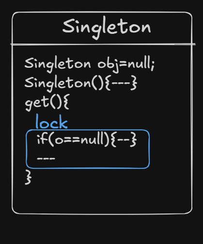

# Singleton Pattern

## 1. Definition

The **Singleton Pattern** restricts the instantiation of a class to only **one object** and provides a **global access point** to that instance.

The class maintains:

- A **private static reference** to itself  
- A **private constructor**  
- A **public static method `get()`** that returns the single instance  

The `get()` method checks:

- If the stored reference is `null` → create the object  
- Otherwise → return the existing object  

---

## 2. Lazy Initialization Singleton

The object is created **only when first requested**.


### Explanation

```java
class Singleton {

    private static Singleton obj = null;

    private Singleton() {}

    public static Singleton get() {
        if (obj == null) {
            obj = new Singleton();
        }
        return obj;
    }
}
```

### How It Works

- `obj` is initially `null`
- First call to `get()` → object is created
- Subsequent calls → same object is returned

### Problem

**Not thread-safe**

If two threads enter `get()` simultaneously, both may create separate objects.

---

## 3. Thread-Safe Singleton (Method Level Locking)

Entire `get()` method is synchronized.



### Explanation

```java
class Singleton {

    private static Singleton obj = null;

    private Singleton() {}

    public static synchronized Singleton get() {
        if (obj == null) {
            obj = new Singleton();
        }
        return obj;
    }
}
```

### How It Works

- Only one thread can enter `get()` at a time
- Prevents multiple instance creation

### Drawback

- Synchronization happens on every call  
-  Even after object is created  
-  Performance overhead  

---

## 4. Thread-Safe Double Locking Singleton

Improves performance by reducing synchronization overhead.


### Explanation

```java
class Singleton {

    private static volatile Singleton obj = null;

    private Singleton() {}

    public static Singleton get() {

        if (obj == null) {                     
            synchronized (Singleton.class) {
                if (obj == null) {             
                    obj = new Singleton();
                }
            }
        }
        return obj;
    }
}
```
### Why Double Check?

Let’s consider **Thread A** and **Thread B**:

1. Thread A enters `get()`
2. `obj == null` → true
3. Thread A enters the `synchronized` block
4. Before Thread A assigns the object, Thread B also enters `get()`
5. `obj == null` → true
6. Thread B waits at the `synchronized` block
7. Thread A creates the object and exits
8. Thread B now enters the `synchronized` block
9. Second check `obj == null` → false
10. Thread B does **NOT** create a new object

Thus, only **one instance** is created.

### Why `volatile`?

Prevents:

- Instruction reordering
- Partial object creation visibility issues between threads

---

## 5. Eager Initialization Singleton

Object is created at class loading time.


### Explanation

```java
class Singleton {

    private static final Singleton obj = new Singleton();

    private Singleton() {}

    public static Singleton get() {
        return obj;
    }
}
```

### How It Works

- Instance created when class is loaded
- Thread-safe due to class loading mechanism

### Drawback

- Instance created even if never used
- Wastes memory if unused  

---

## 6. Comparison

| Type                     | Thread Safe | Performance | Lazy | Memory Efficient |
|--------------------------|------------|------------|------|------------------|
| Lazy Initialization      |  No      |  Fast    |  Yes |  Yes |
| Synchronized Method      |  Yes     |  Slow    |  Yes |  Yes |
| Double Locking           |  Yes     |  Fast    |  Yes |  Yes |
| Eager Initialization     |  Yes     |  Fast    |  No  |  No  |

---

## 7. When to Use Singleton

- Logging systems  
- Configuration manager  
- Database connection pool  
- Caching mechanism  
- Thread pool manager  

---

## 8. Conclusion

Singleton ensures:

- Controlled instantiation  
- Single shared instance  
- Global access point  

👉 **Double Locking** is usually preferred for thread-safe and performance-efficient lazy initialization.
